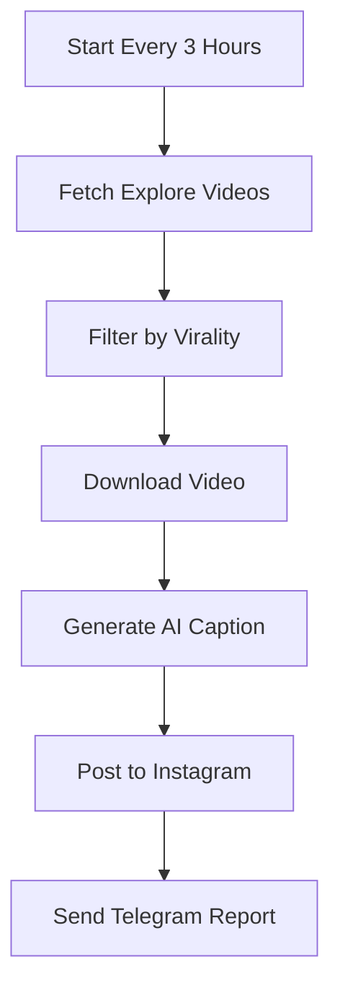

# Instagram Auto-Repost Bot - Viral Video Edition 🔥

An advanced automated Instagram bot that **automatically finds, downloads, and reposts viral videos** from Instagram Explore every 3 hours. Features AI-powered captions using OpenAI GPT-5, intelligent video filtering, and comprehensive Telegram notifications.

## 🚀 Key Features

### Core Automation
- ✅ **Auto-Scrape Viral Videos** - Automatically finds trending videos from Instagram Explore
- 🎯 **Smart Filtering** - Filters videos by likes, views, and engagement rate
- 📥 **Watermark-Free Download** - Downloads videos without watermarks using instagrapi
- 🤖 **AI Caption Generation** - Creates engaging captions with OpenAI GPT-5
- ⏰ **Scheduled Auto-Posting** - Posts every 3 hours (customizable interval)
- 📱 **Enhanced Telegram Notifications** - Detailed reports with video stats and timestamps

### Technical Features
- ⚡ **Async/Await Architecture** - Non-blocking operations for maximum performance
- 🔄 **HTTP/2 Connection Pooling** - Persistent connections reduce latency
- 💾 **Intelligent Caching** - LRU cache for optimized performance
- 🛡️ **Production Ready** - Comprehensive error handling and logging
- 📦 **Auto-Backup** - Creates downloadable ZIP when credit limit reached

## 📊 How It Works



## Prerequisites

1. **Instagram Business Account** connected to a Facebook Page (for posting)
2. **Regular Instagram Account** (for scraping Explore page - can be different from business account)
3. **Facebook Developer Account** with Instagram Graph API access
4. **OpenAI API Key** for AI caption generation
5. **Telegram Bot** (create via @BotFather)
6. **Video Hosting** - Public HTTPS URL for video hosting (CDN/cloud storage)

## Quick Start

### 1. Configure Environment

```bash
cp .env.example .env
# Edit .env with your credentials (see Configuration section below)
```

### 2. Install Dependencies

Dependencies are auto-installed via Replit packager system.

### 3. Run the Bot

```bash
bash run_bot.sh
```

## Configuration

### Environment Variables

Create a `.env` file with these variables:

#### Instagram Credentials
```env
# Instagram Business Account (for posting)
INSTAGRAM_ACCESS_TOKEN=your_instagram_access_token
INSTAGRAM_USER_ID=your_instagram_business_user_id
GRAPH_API_VERSION=v21.0

# Regular Instagram Account (for scraping)
INSTAGRAM_SCRAPER_USERNAME=your_instagram_username
INSTAGRAM_SCRAPER_PASSWORD=your_instagram_password
INSTAGRAM_SESSION_FILE=instagram_session.json
```

#### OpenAI Configuration
```env
OPENAI_API_KEY=your_openai_api_key
USE_AI_CAPTIONS=true
```

#### Telegram Bot
```env
TELEGRAM_BOT_TOKEN=your_telegram_bot_token
TELEGRAM_CHAT_ID=your_telegram_chat_id
```

#### Auto-Repost Settings
```env
# Posting interval in hours
POSTING_INTERVAL_HOURS=3

# Viral video filters
MIN_LIKES=10000
MIN_VIEWS=50000
MIN_ENGAGEMENT_RATE=0.05
EXPLORE_FETCH_COUNT=50

# Download path
VIDEO_DOWNLOAD_PATH=downloaded_videos
```

#### Video Hosting (REQUIRED)
```env
# Public HTTPS URL - You need to implement video hosting
VIDEO_URL=https://your-cdn.com/video.mp4
```

## 🔧 Files Structure

```
instagram-bot/
├── main.py                    # Main entry point
├── scheduler.py               # Auto-repost scheduler (every 3 hours)
├── instagram_scraper.py       # Scrapes viral videos from Explore
├── video_downloader.py        # Downloads videos without watermark
├── caption_generator.py       # AI-powered caption generator (OpenAI GPT-5)
├── instagram_poster.py        # Posts to Instagram Graph API
├── telegram_notifier.py       # Enhanced Telegram notifications
├── credit_monitor.py          # Credit monitoring
├── server.py                  # Flask server for endpoints
├── requirements.txt           # Python dependencies
├── .env.example              # Environment template
├── README.md                 # This file
└── run_bot.sh               # Run script
```

## 📈 Auto-Repost Process

### 1. Find Viral Video
- Fetches 50 videos from Instagram Explore
- Filters by:
  - Minimum likes (default: 10,000)
  - Minimum views (default: 50,000)
  - Engagement rate (default: 5%)
- Selects random from top 5 viral videos

### 2. Download Video
- Downloads video using instagrapi
- No watermarks
- Saves to `downloaded_videos/` folder

### 3. Generate AI Caption
- Uses OpenAI GPT-5 for catchy captions
- Includes:
  - Attention-grabbing hook
  - 15-20 trending hashtags
  - Call-to-action
- Falls back to templates if API fails

### 4. Post to Instagram
- Creates media container
- Polls for processing status
- Publishes as Reel

### 5. Send Telegram Report
Includes:
- 🎬 Video title
- 👤 Original author
- ❤️ Likes & 👁 Views
- 📝 Caption preview
- ✅ Status
- 🆔 Media ID
- ⏰ Timestamp
- ⚡ Duration

## 🤖 AI Caption Generation

The bot uses **OpenAI GPT-5** (latest model as of August 2025) to generate engaging captions:

```python
# Example generated caption
🚀 This is absolutely mind-blowing! 🤯

#Viral #Trending #Amazing #Incredible #MustWatch
#Explore #ForYou #Wow #Insane #Epic #Insta
#InstaDaily #Reels #Vibes #Motivation

Follow for more! 💯
```

**Fallback:** If OpenAI API fails, uses template-based generation.

## 📱 Telegram Notifications

Enhanced notifications include:

**Success Example:**
```
📸 Instagram Post Published!

🎬 Video: Incredible AI demo by @tech...
👤 Author: @techcreator
❤️ Likes: 45,230 | 👁 Views: 250,000

📝 Caption Preview:
🚀 This is absolutely mind-blowing! 🤯...

✅ Status: Posted Successfully
🆔 Media ID: 123456789
⏰ Posted At: 2025-10-17 14:30:00
⚡ Duration: 15.3s
```

## ⚙️ Advanced Configuration

### Adjust Posting Interval
```env
POSTING_INTERVAL_HOURS=3  # Post every 3 hours (default)
POSTING_INTERVAL_HOURS=6  # Post every 6 hours
POSTING_INTERVAL_HOURS=1  # Post every hour (not recommended)
```

### Customize Viral Filters
```env
MIN_LIKES=50000           # Higher threshold
MIN_VIEWS=100000          # Only very viral videos
MIN_ENGAGEMENT_RATE=0.10  # 10% engagement minimum
EXPLORE_FETCH_COUNT=100   # Fetch more videos to choose from
```

### Disable AI Captions
```env
USE_AI_CAPTIONS=false  # Use template-based captions instead
```

## 🔒 Security Features

- ✅ All credentials loaded from `.env` file
- ✅ Session persistence for Instagram scraper
- ✅ Comprehensive error handling prevents crashes
- ✅ Detailed logging for debugging
- ✅ Secure API endpoints with authentication
- ✅ Auto-cleanup of downloaded videos

## 🚨 Important Notes

### Video Hosting Requirement
**You MUST implement video hosting** to get a public HTTPS URL for posting to Instagram. The bot downloads videos locally, but Instagram Graph API requires a publicly accessible URL.

**Recommended Solutions:**
- AWS S3 + CloudFront CDN
- Cloudinary
- Google Cloud Storage
- Azure Blob Storage
- Any CDN service

**Implementation needed:**
1. Upload downloaded video to your hosting service
2. Get public HTTPS URL
3. Use that URL for posting

### Instagram Account Requirements
- **Scraping account**: Regular Instagram account (can be any account)
- **Posting account**: Must be Instagram Business account linked to Facebook Page
- **These can be different accounts** (recommended for security)

### Rate Limits
- Instagram has rate limits on scraping and posting
- Default 3-hour interval is safe
- Don't decrease below 1 hour to avoid bans
- Use delays and respect Instagram's ToS

## 🛠️ Troubleshooting

### Login Failed
- Check Instagram credentials in `.env`
- Clear `instagram_session.json` and retry
- Use an account without 2FA (or handle 2FA)

### Download Failed
- Ensure video is public
- Check internet connection
- Try different video from Explore

### OpenAI API Error
- Verify `OPENAI_API_KEY` is correct
- Check API quota/billing
- Bot will fall back to templates automatically

### Post Failed
- Verify Instagram Business account is linked to Facebook Page
- Check `INSTAGRAM_ACCESS_TOKEN` is valid (60-day expiry)
- Ensure video URL is publicly accessible HTTPS

## 📦 Deployment

### On Replit (Current)
- Runs automatically
- Credit monitoring included
- Auto-backup when limit reached

### On VPS/Cloud
1. Download bot package
2. Install Python 3.11+
3. Install dependencies: `pip install -r requirements.txt`
4. Configure `.env`
5. Run: `python main.py`

## 📝 License

This project is provided as-is for educational purposes. Please respect Instagram's Terms of Service and API usage policies.

## ⚠️ Disclaimer

- Use responsibly and ethically
- Respect original content creators
- Follow Instagram's Terms of Service
- Don't spam or abuse the platform
- This is for educational purposes

---

**⚡ Powered by OpenAI GPT-5, Instagram Graph API, and Instagrapi for automated viral content discovery and reposting!**
